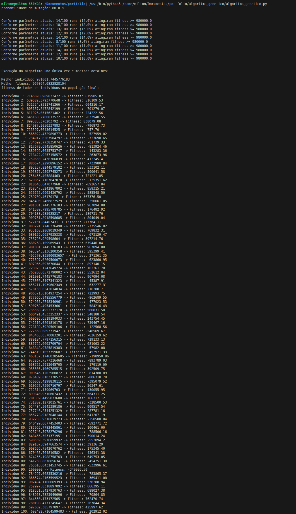

# Algoritmo Genético - Otimização de f(x) = x * sin(x)

Algoritmo genético em Python para otimizar a função f(x) = x * sin(x). Implementa evolução natural com seleção por torneio, crossover aritmético, mutação adaptativa e elitismo para encontrar o valor ótimo da função.

## Exemplo de execução


*Execução completa mostrando evolução detalhada da população ao longo de múltiplas gerações*

## Descrição

O algoritmo busca o valor de x que maximiza f(x) = x * sin(x) através de um processo evolutivo com critério de convergência adaptativo:

1. **Inicialização:** População de 300 indivíduos com valores aleatórios no intervalo [0, 500]
2. **Avaliação:** Cálculo do fitness usando f(x) = x * sin(x)
3. **Seleção:** Torneio entre 4 indivíduos (2 torneios paralelos geram 2 pais)
4. **Crossover (pc=80%):** Combinação aritmética entre pais
5. **Mutação (pm=80%):** Perturbação aleatória com magnitude θ = 5% do intervalo
6. **Elitismo:** Substituição dos 2 piores pelos 2 melhores da geração anterior
7. **Convergência:** Algoritmo para após 20 gerações sem melhoria no fitness

## Componentes do algoritmo

**Seleção:** Torneio entre 4 indivíduos (escolhe melhor de cada par)  
**Crossover:** Combinação aritmética com α aleatório: filho = α×pai1 + (1-α)×pai2  
**Mutação:** Perturbação uniforme no intervalo [-θ, +θ] onde θ = 25 (5% de 500)  
**Elitismo:** Preservação dos 2 melhores indivíduos substituindo os 2 piores  
**Convergência:** Para após 20 gerações consecutivas sem melhoria no top-2 fitness

## Execução
Ambiente virtual recomendado:

```bash
python -m venv venv
source venv/bin/activate  # Linux/macOS
```

Dependências opcionais:
```bash
pip install sympy
```

Execução:
```bash
python algoritmo_genetico.py
```

## Metodologia de teste

O script executa 10 blocos experimentais, cada um realizando 100 runs independentes (total: 1000 execuções) com populações iniciais distintas. 

**Métrica de avaliação:** Conta quantas vezes o fitness melhora ao longo dos 100 runs dentro de cada bloco, rastreando o melhor fitness encontrado.

Esta abordagem permite avaliar:
- Consistência do algoritmo sob diferentes condições iniciais
- Capacidade de encontrar soluções progressivamente melhores
- Robustez dos parâmetros escolhidos

## Parâmetros atuais

```python
valor_min = 0              # Limite inferior do espaço de busca
valor_max = 500            # Limite superior do espaço de busca
tamanho_populacao = 300    # Número de indivíduos por geração
pm = 0.8                   # Probabilidade de mutação (80%)
pc = 0.8                   # Probabilidade de crossover (80%)
teta = 25                  # Magnitude da mutação (5% do intervalo)
convergencia = 20          # Gerações sem melhoria para parar
```

## Impacto dos parâmetros

| Parâmetro | Valor Atual | Impacto |
|-----------|-------------|---------|
| **Espaço de busca** | [0, 500] | Reduzido para melhor convergência (antes: [0, 1M]) |
| **População** | 300 | Triplicada para maior diversidade (antes: 100) |
| **Mutação (pm)** | 80% | Alta exploração do espaço de soluções |
| **Crossover (pc)** | 80% | Alta recombinação genética |
| **θ (teta)** | 25 | Perturbação moderada (5% do range) |
| **Elitismo** | 2 melhores | Garante preservação das melhores soluções |

## Análise experimental

Este projeto inclui análise experimental detalhada com **validação estatística robusta**:

### Metodologia aplicada:
- **1000 execuções** organizadas em 10 blocos de 100 runs cada
- **Múltiplos espaços de busca** para validar escalabilidade do algoritmo
- **Variação sistemática** da probabilidade de mutação (pm = 0.1 vs pm = 0.8)
- **Análise comparativa** entre diferentes configurações de parâmetros

### Resultados experimentais:
- **Teste 1** (espaço [0,100]): População 1000, amostra 100 (10% do espaço)
  - pm = 0.1: Taxa de sucesso média **12.9%**
  - pm = 0.8: Taxa de sucesso média **16.4%**

- **Teste 2** (espaço [0,1.000.000]): População 1M, amostra 100 (0.01% do espaço)  
  - pm = 0.1: Taxa de sucesso média **10.2%**
  - pm = 0.8: Taxa de sucesso média **13.6%**

### Documentação:
- [Relatório de análise experimental](./docs/analise_experimentos.md) - Comparação sistemática de parâmetros e conclusões técnicas
- [Relatório completo em PDF](./docs/relatorio_algoritmo_genetico.pdf) - Análise experimental com metodologia científica completa, incluindo justificativa estatística e resultados detalhados

