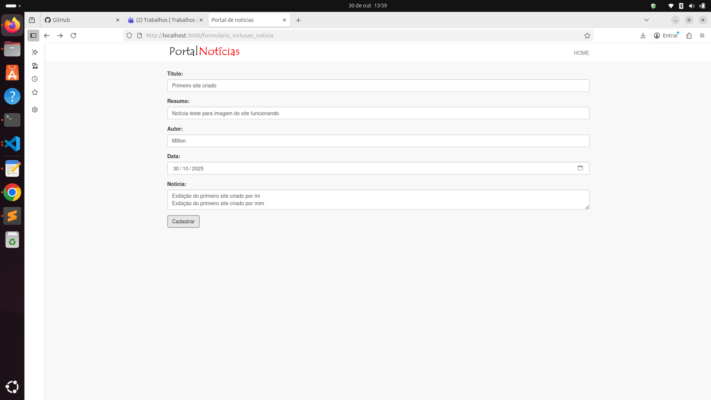

# Portal de Notícias

Aplicação web para visualização e gerenciamento de notícias. Sistema simples com interface para leitura e painel administrativo para inclusão de conteúdo.

## 🌐 Demo Online

**Acesse o projeto funcionando:** [https://portalnoticias.up.railway.app](https://portalnoticias.up.railway.app)

### Como usar:
- **Navegar:** Explore as notícias pela página inicial
- **Visualizar:** Clique em qualquer notícia para ler o conteúdo completo
- **Adicionar:** Use o botão verde "ADICIONAR NOTÍCIA" no menu para criar novos posts

## Screenshots


*Página inicial com listagem das últimas notícias*


*Página de leitura completa da notícia*


*Página que  mostra todas da notícias*


*Painel administrativo para adicionar novas notícias*

## Stack tecnológica

### Backend
- **Node.js** com Express.js
- **MySQL2** para conexão com banco de dados MySQL 8.0
- **Template engine EJS** para renderização server-side
- **Express Validator** para validação de dados
- **Consign** para injeção de dependências

### Frontend
- **CSS customizado** com Bootstrap 3
- **jQuery** para interações do lado cliente
- **Design responsivo** com sistema de grid

### Deploy e Infraestrutura
- **Railway** para hospedagem gratuita
- **MySQL em nuvem** com Railway
- **Deploy automático** via GitHub
- **Variáveis de ambiente** para configuração segura

## Funcionalidades

- ✅ Listagem de notícias na página inicial
- ✅ Visualização completa de artigos individuais  
- ✅ Formulário administrativo para criação de notícias
- ✅ Validação de dados no backend antes da persistência
- ✅ Menu de navegação intuitivo
- ✅ Sistema responsivo para mobile e desktop

## Arquitetura do projeto

```
portal_noticias/
├── app/
│   ├── controllers/     # lógica de negócio
│   ├── models/         # camada de acesso a dados (DAO)
│   ├── routes/         # definição de rotas
│   ├── views/          # templates EJS
│   └── public/         # assets estáticos
├── config/
│   ├── server.js       # configuração do Express
│   └── dbConnection.js # configuração do MySQL
└── app.js             # ponto de entrada
```

Implementa o padrão MVC com injeção de dependências via Consign para carregamento automático dos módulos.

## Instalação e execução

Pré-requisitos: Node.js e MySQL instalados.

1. Clone o repositório:
   ```bash
   git clone [url-do-repositorio]
   cd portal_noticias
   ```

2. Instale as dependências:
   ```bash
   npm install
   ```

3. Configure o banco de dados:
   - Crie um banco MySQL
   - Configure a conexão em `config/dbConnection.js`
   - Execute o script SQL para criar a tabela

4. Inicie o servidor:
   ```bash
   node app.js
   ```

5. Acesse: `http://localhost:3000`

## Schema do banco

```sql
CREATE TABLE noticias (
    id_noticia INT AUTO_INCREMENT PRIMARY KEY,
    titulo VARCHAR(255) NOT NULL,
    noticia TEXT NOT NULL,
    data_criacao TIMESTAMP DEFAULT CURRENT_TIMESTAMP,
    resumo TEXT,
    autor VARCHAR(100),
    data_noticia DATE
);
```

## Principais Aprendizados

- **Arquitetura MVC:** Implementação de uma arquitetura organizada e escalável
- **Express.js:** Configuração de servidor web com middleware
- **Template Engine:** Renderização dinâmica de páginas com EJS
- **Banco de Dados:** Integração com MySQL usando padrão DAO
- **Validação:** Implementação de validação de dados no backend
- **Roteamento:** Organização de rotas em módulos separados
- **Deploy em Nuvem:** Configuração de variáveis de ambiente e deploy no Railway
- **MySQL 8.0:** Compatibilidade com versões modernas usando mysql2
- **Git/GitHub:** Versionamento e integração contínua

## Melhorias futuras

- [ ] Sistema de autenticação de usuários
- [ ] Categorização de notícias
- [ ] Paginação para grandes volumes de dados
- [ ] Upload e gerenciamento de imagens
- [ ] Funcionalidade de busca
- [ ] Migração para ES6+ com async/await
- [ ] Implementação de testes unitários
- [ ] Sistema de cache

## Endpoints da API

| Método | Rota | Funcionalidade |
|--------|------|----------------|
| `GET` | `/` | Página inicial com últimas notícias |
| `GET` | `/noticias` | Lista completa de notícias |
| `GET` | `/noticia/:id` | Detalhes de notícia específica |
| `GET` | `/formulario_inclusao_noticia` | Formulário para nova notícia |
| `POST` | `/noticias/salvar` | Persistência de nova notícia |


## Deploy gratuito no Railway

### Passo 1: Preparar o repositório
1. Certifique-se de que o código está no GitHub
2. Verifique se existe o arquivo `.env.example` com as variáveis necessárias

### Passo 2: Criar conta no Railway
1. Acesse [railway.app](https://railway.app)
2. Clique em "Login" no canto superior direito
3. Escolha "Sign in with GitHub"
4. Autorize o Railway a acessar seus repositórios

### Passo 3: Criar novo projeto
1. No painel do Railway, clique em "New Project"
2. Selecione "Deploy from GitHub repo"
3. Procure e selecione o repositório `portfolio` (ou nome do seu repo)
4. Escolha a pasta `portal_noticias` se pedido

### Passo 4: Adicionar banco de dados MySQL
1. No projeto criado, clique em "New" > "Database" > "Add MySQL"
2. Aguarde a criação do banco (leva cerca de 1-2 minutos)
3. Clique no serviço MySQL criado
4. Na aba "Variables", copie os valores:
   - `MYSQL_HOST`
   - `MYSQL_USER` 
   - `MYSQL_PASSWORD`
   - `MYSQL_DATABASE`
   - `MYSQL_PORT`

### Passo 5: Configurar variáveis de ambiente
1. Clique no serviço da aplicação (nome do repositório)
2. Vá na aba "Variables"
3. Adicione as seguintes variáveis:

```
PORT=3000
DB_HOST=[valor do MYSQL_HOST]
DB_USER=[valor do MYSQL_USER]  
DB_PASS=[valor do MYSQL_PASSWORD]
DB_NAME=[valor do MYSQL_DATABASE]
```

### Passo 6: Deploy automático
1. O Railway fará o deploy automaticamente
2. Aguarde cerca de 2-3 minutos
3. Se der erro, clique em "Deployments" para ver os logs

### Passo 7: Importar esquema do banco
1. No serviço MySQL, clique em "Connect"
2. Use o comando mostrado ou ferramenta como phpMyAdmin
3. Execute o script SQL para criar a tabela `noticias`:

```sql
CREATE TABLE noticias (
    id_noticia INT AUTO_INCREMENT PRIMARY KEY,
    titulo VARCHAR(255) NOT NULL,
    noticia TEXT NOT NULL,
    data_criacao TIMESTAMP DEFAULT CURRENT_TIMESTAMP,
    resumo TEXT,
    autor VARCHAR(100),
    data_noticia DATE
);
```

### Passo 8: Obter URL pública
1. Na aba "Settings" do serviço da aplicação
2. Clique em "Generate Domain"
3. Sua aplicação estará disponível na URL gerada!

### Solução de problemas comuns
- **Erro de conexão DB:** Verifique se as variáveis estão corretas
- **App não inicia:** Verifique os logs na aba "Deployments"  
- **Porta incorreta:** Certifique-se que PORT=3000 está configurado

## 🔗 Links do Projeto

- **🌐 Demo Online:** [https://portalnoticias.up.railway.app](https://portalnoticias.up.railway.app)
- **📋 Repositório:** [https://github.com/miltonRafa/portfolio](https://github.com/miltonRafa/portfolio)
- **📖 Guia de Deploy:** [DEPLOY.md](./DEPLOY.md)

## Desenvolvedor

**Milton Rafa** - [LinkedIn](https://linkedin.com/in/milton-r-dev) - miltonrs.dev@gmail.com

---

*Este projeto demonstra competências em desenvolvimento full-stack Node.js, deploy em nuvem e boas práticas de desenvolvimento.*