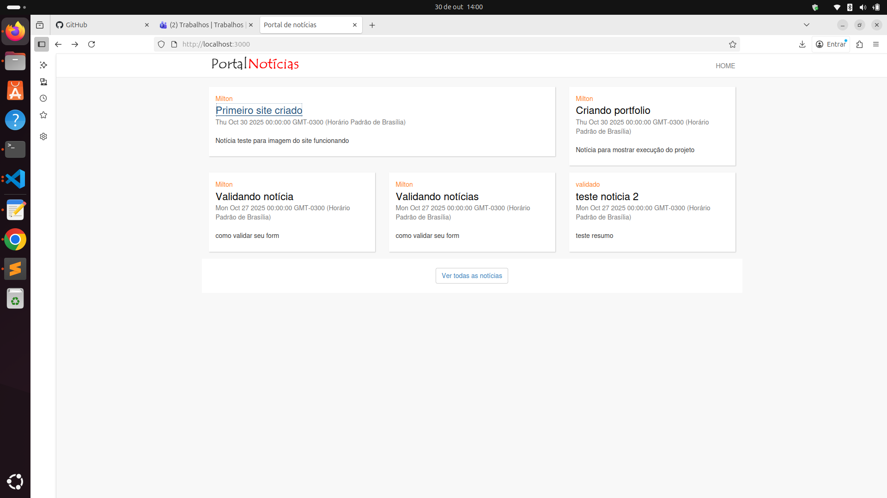
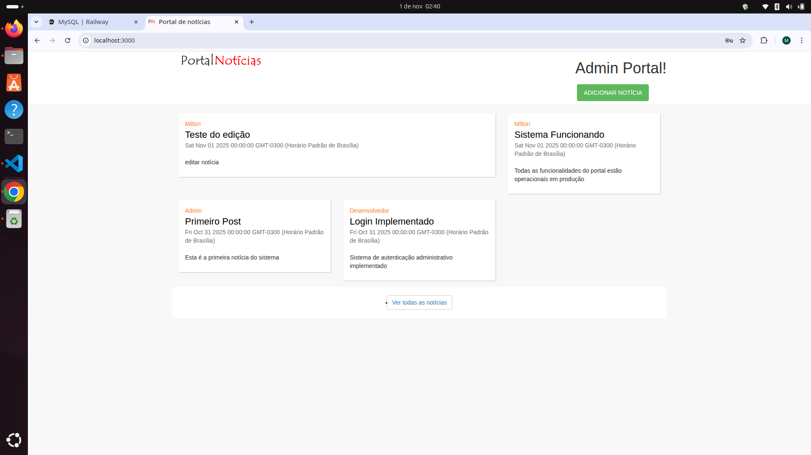
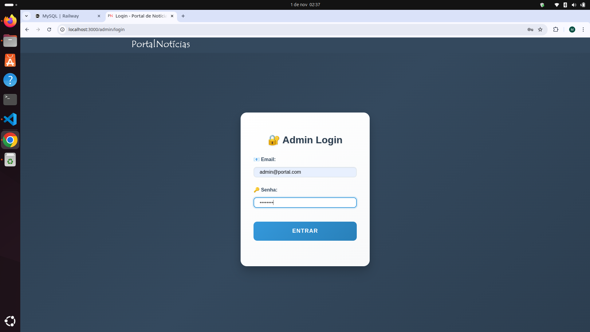
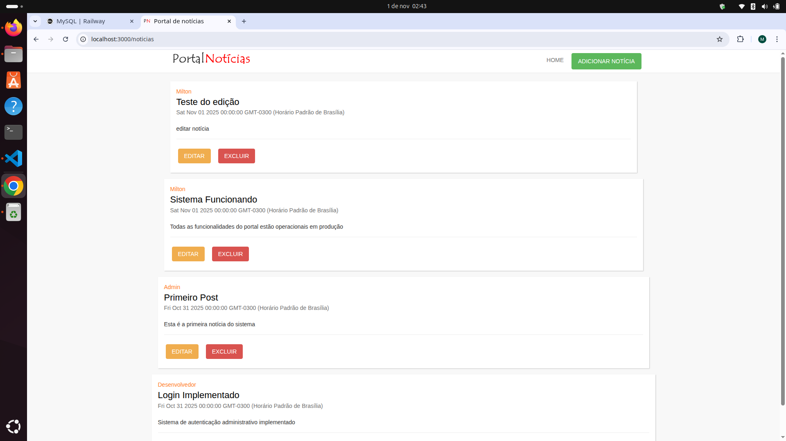
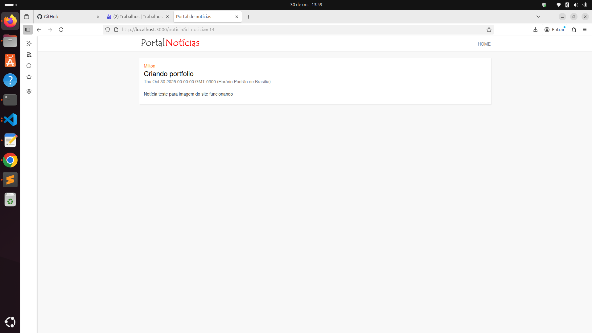
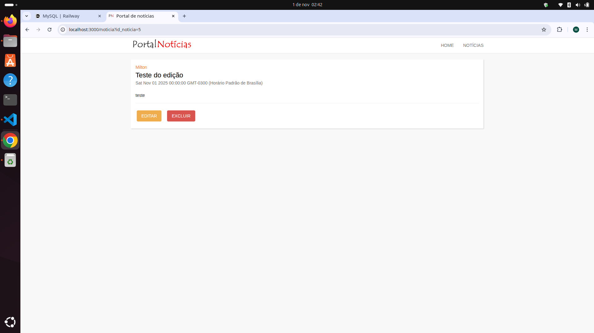
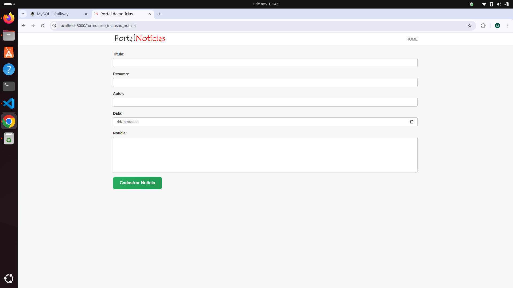
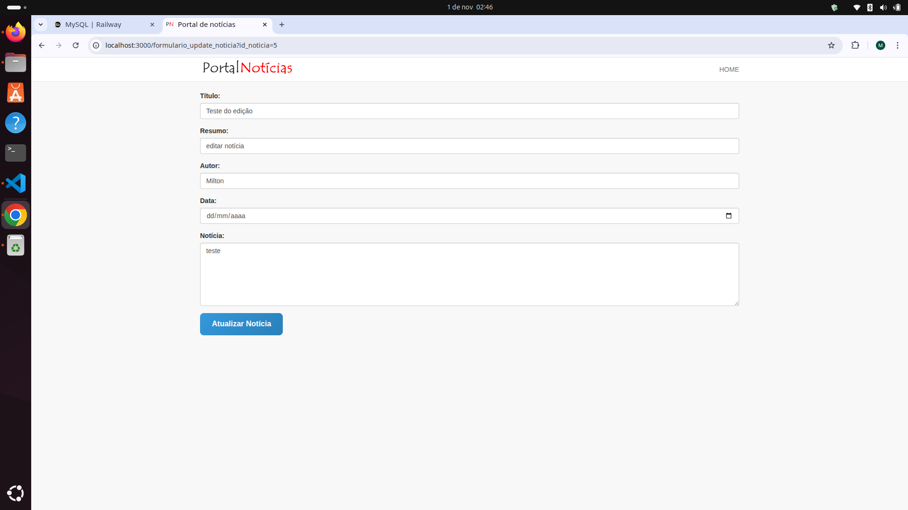
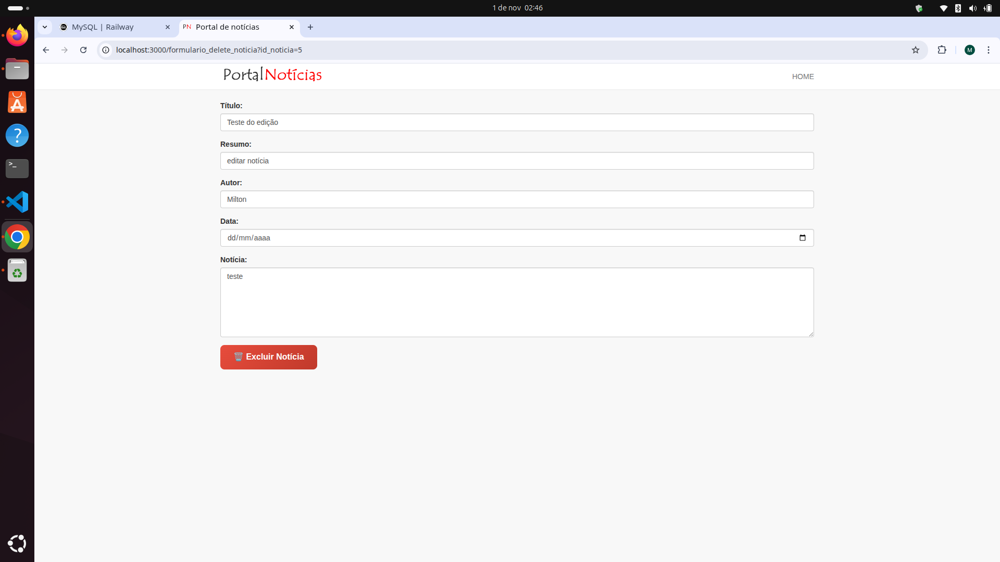

# 📰 Portal de Notícias

Aplicação web full-stack para gerenciamento e visualização de notícias com sistema de autenticação administrativo completo. Projeto desenvolvido seguindo padrão MVC com arquitetura escalável.

## 🌐 Demo Online

**Acesse o projeto funcionando:** [https://portalnoticias.up.railway.app](https://portalnoticias.up.railway.app)

### 🔑 Como usar:
- **👁️ Navegar:** Explore as notícias pela página inicial sem autenticação
- **📖 Visualizar:** Clique em qualquer notícia para ler o conteúdo completo  
- **🔐 Admin:** Acesse `/admin/login` com credenciais: `admin@portal.com` / `admin123`
- **➕ Gerenciar:** Após login, botões EDITAR/EXCLUIR aparecem automaticamente
- **🛡️ Proteção:** Rotas administrativas protegidas por middleware de autenticação

## 🎯 Funcionalidades Implementadas

### 👥 Sistema de Usuários
- ✅ **Autenticação completa** com login funcional
- ✅ **Sistema de sessões** com express-session
- ✅ **Proteção de rotas administrativas** com middleware `verificaAutenticacao`
- ✅ **Controle de acesso** - botões admin só aparecem para usuários logados
- ✅ **Validação de credenciais** via banco de dados

### 📝 Gestão de Notícias
- ✅ **CRUD completo** (Create, Read, Update, Delete)
- ✅ **Validação robusta** com express-validator
- ✅ **Interface intuitiva** com formulários responsivos
- ✅ **Confirmação de exclusão** com JavaScript
- ✅ **Tratamento de erros** e mensagens de feedback

### 🎨 Interface e UX
- ✅ **Design responsivo** com Bootstrap 3 + CSS customizado
- ✅ **Botões estilizados** com cores diferenciadas por ação
- ✅ **Navegação contextual** baseada em autenticação
- ✅ **Controles administrativos condicionais** - só aparecem para usuários logados
- ✅ **Feedback visual** para todas as ações
- ✅ **Loading states** e tratamento de erros

### 🔑 Controle de Interface Inteligente
```javascript
// Em todos os controllers públicos (home, noticias)
var usuario = req.session.usuario;  // Recupera usuário da sessão

res.render("template", {
    usuario: usuario,  // Passa para o template
    // ... outros dados
});
```

```html
<!-- Nos templates EJS - Botões só aparecem se usuário logado -->
<% if(typeof usuario !== 'undefined' && usuario) { %>
    <a href="formulario_update_noticia?id_noticia=<%=noticia.id%>" class="btn-edit">EDITAR</a>
    <a href="formulario_delete_noticia?id_noticia=<%=noticia.id%>" class="btn-delete">EXCLUIR</a>
<% } %>
```

### 🗄️ Banco de Dados
- ✅ **Dual environment** (local + Railway)
- ✅ **Tabela usuarios** com timestamps automáticos
- ✅ **Tabela noticias** com campos completos
- ✅ **Scripts SQL** unificados para setup
- ✅ **Conexão segura** com variáveis de ambiente

## Screenshots


*Página inicial - Vista do visitante sem autenticação*


*Página inicial - Vista do administrador com botão "ADICIONAR NOTÍCIA"*


*Interface de autenticação administrativa com CSS customizado*


*Listagem de notícias - Vista pública sem botões administrativos*


*Listagem de notícias - Vista admin com botões EDITAR/EXCLUIR*


*Página de leitura - Vista do visitante*


*Página de leitura - Vista admin com controles administrativos*


*Formulário de criação com validação completa*


*Formulário de edição com dados pré-preenchidos*


*Confirmação de exclusão com dados da notícia*

## 🛠️ Stack Tecnológica

### Backend
- **Node.js 20+** com Express.js framework
- **MySQL2** para conexão com banco MySQL 8.0
- **EJS** template engine para renderização server-side
- **Express Validator** para validação robusta de dados
- **Express Session** para gerenciamento de sessões
- **Consign** para injeção de dependências automática
- **Body Parser** para parsing de formulários

### Frontend
- **Bootstrap 3** para grid system e componentes base
- **CSS3 customizado** com gradientes e animações
- **jQuery 2.2.1** para interações client-side
- **Design responsivo** com media queries
- **Tipografia otimizada** e iconografia emoji

### Deploy e Infraestrutura
- **Railway** para hospedagem gratuita em nuvem
- **MySQL Railway** com backup automático
- **Deploy automático** via GitHub integration
- **Variáveis de ambiente** para configuração segura
- **SSL/HTTPS** automático no Railway

## 📊 Arquitetura do Projeto

```
portal_noticias/
├── 📁 app/
│   ├── 🎮 controllers/         # Lógica de negócio (MVC Controller)
│   │   ├── admin.js           # CRUD + Autenticação
│   │   ├── home.js            # Página inicial
│   │   └── noticias.js        # Visualização pública
│   ├── 📦 models/             # Camada de dados (DAO Pattern)
│   │   └── NoticiasDAO.js     # Operações de banco
│   ├── 🛣️ routes/              # Definição de rotas
│   │   ├── admin.js           # Rotas administrativas
│   │   ├── home.js            # Rota inicial
│   │   └── noticias.js        # Rotas públicas + protegidas
│   ├── 🎨 views/              # Templates EJS (MVC View)
│   │   ├── admin/             # Formulários administrativos
│   │   ├── home/              # Página inicial
│   │   └── noticias/          # Visualização de notícias
│   └── 🌐 public/             # Assets estáticos
│       ├── css/style.css      # CSS customizado
│       ├── js/jquery.js       # JavaScript
│       └── images/logo.png    # Recursos visuais
├── ⚙️ config/
│   ├── server.js              # Configuração Express + Middleware
│   └── dbConnection.js        # Configuração MySQL dual-env
├── 📄 database.sql            # Script completo de setup
├── 📋 package.json            # Dependências e scripts
└── 🚀 app.js                  # Entry point da aplicação
```

**Padrões implementados:**
- **MVC (Model-View-Controller)** para separação de responsabilidades
- **DAO (Data Access Object)** para abstração de banco de dados  
- **Dependency Injection** via Consign para modularidade
- **Environment Configuration** para múltiplos ambientes

## 🔐 Sistema de Autenticação

### Fluxo de Autenticação
1. **Login:** `/admin/login` → Validação via banco → Criação de sessão
2. **Proteção:** Middleware `verificaAutenticacao` verifica sessão em rotas administrativas
3. **Contexto:** Views recebem dados do usuário logado via `req.session.usuario`
4. **Controle visual:** Botões administrativos só aparecem para usuários autenticados
5. **Redirecionamento:** Usuários não autenticados são redirecionados para `/admin/login`

### Rotas Protegidas
- ✅ Todas as rotas administrativas (`/formulario_*` e `/noticias/*` CRUD)
- ✅ Middleware aplicado em todas as operações de criação/edição/exclusão
- ✅ Redirecionamento automático para login se não autenticado

### Segurança Implementada
- ✅ **Middleware de autenticação** em todas as rotas administrativas
- ✅ **Controle de sessão** com verificação em cada request
- ✅ **Validação server-side** em todas as operações
- ✅ **Sanitização de dados** via express-validator
- ✅ **Prevenção de SQL injection** via prepared statements
- ✅ **Controle de interface** - botões condicionais baseados em autenticação

## 📋 API Endpoints

### 🌐 Rotas Públicas
| Método | Rota | Funcionalidade | Autenticação |
|--------|------|----------------|--------------|
| `GET` | `/` | Página inicial com 5 últimas notícias | ❌ |
| `GET` | `/noticias` | Lista completa de notícias | ❌ |
| `GET` | `/noticia?id_noticia=X` | Detalhes de notícia específica | ❌ |

### 🔒 Rotas Administrativas
| Método | Rota | Funcionalidade | Autenticação |
|--------|------|----------------|--------------|
| `GET` | `/admin/login` | Formulário de login | ❌ |
| `POST` | `/admin/login` | Processar autenticação | ❌ |
| `GET` | `/formulario_inclusao_noticia` | Formulário para nova notícia | ✅ |
| `POST` | `/noticias/salvar` | Criar nova notícia | ✅ |
| `GET` | `/formulario_update_noticia?id_noticia=X` | Formulário de edição | ✅ |
| `POST` | `/noticias/update` | Atualizar notícia existente | ✅ |
| `GET` | `/formulario_delete_noticia?id_noticia=X` | Formulário de confirmação | ✅ |
| `POST` | `/noticias/delete` | Excluir notícia | ✅ |

**Legenda:** ✅ Protegido com middleware | ❌ Público

### 🎯 Arquitetura de Segurança
- **Middleware `verificaAutenticacao`**: Verifica `req.session.usuario` antes de permitir acesso
- **Redirecionamento automático**: Usuários não autenticados → `/admin/login`  
- **Interface condicional**: Botões administrativos só aparecem se `usuario` existir na sessão
- **Rotas públicas**: `/`, `/noticias`, `/noticia` - acessíveis sem autenticação
- **Controles visuais**: EDITAR/EXCLUIR só visíveis para administradores logados

## 🗄️ Schema do Banco de Dados

### Tabela `noticias`
```sql
CREATE TABLE noticias (
    id_noticia INT AUTO_INCREMENT PRIMARY KEY,
    titulo VARCHAR(255) NOT NULL,
    noticia TEXT NOT NULL,
    data_criacao TIMESTAMP DEFAULT CURRENT_TIMESTAMP,
    resumo TEXT,
    autor VARCHAR(100),
    data_noticia DATE
) ENGINE=InnoDB DEFAULT CHARSET=utf8mb4;
```

### Tabela `usuarios`
```sql
CREATE TABLE usuarios (
    id INT AUTO_INCREMENT PRIMARY KEY,
    nome VARCHAR(100) NOT NULL,
    email VARCHAR(150) NOT NULL UNIQUE,
    senha VARCHAR(255) NOT NULL,
    created_at TIMESTAMP DEFAULT CURRENT_TIMESTAMP,
    updated_at TIMESTAMP DEFAULT CURRENT_TIMESTAMP ON UPDATE CURRENT_TIMESTAMP
) ENGINE=InnoDB DEFAULT CHARSET=utf8mb4;
```

## 🚀 Instalação e Execução

### Pré-requisitos
- **Node.js 20+** 
- **MySQL 8.0+**
- **Git**

### 1️⃣ Clone e Setup
```bash
git clone https://github.com/miltonRafa/portfolio.git
cd portfolio/portal_noticias
npm install
```

### 2️⃣ Configuração do Banco
```bash
# Criar banco local
mysql -u root -p -e "CREATE DATABASE railway;"

# Executar script de setup
mysql -u root -p railway < database.sql
```

### 3️⃣ Configuração de Ambiente
```bash
# Copie e edite as variáveis conforme seu ambiente
cp .env.example .env

# Para desenvolvimento local:
# DB_HOST=localhost
# DB_USER=root  
# DB_PASS=
# DB_NAME=railway
# DB_PORT=3306
```

### 4️⃣ Executar Aplicação
```bash
# Desenvolvimento
npm start

# Com auto-reload (instale nodemon globalmente)
npm install -g nodemon
nodemon app.js
```

### 5️⃣ Acessar Sistema
- **Site:** http://localhost:3000
- **Admin:** http://localhost:3000/admin/login
- **Credenciais:** admin@portal.com / admin123

## 🌩️ Deploy no Railway (Gratuito)

### Setup Rápido
1. **Fork** este repositório
2. **Conecte** Railway ao GitHub
3. **Deploy** o projeto portal_noticias
4. **Adicione** banco MySQL no Railway
5. **Configure** variáveis de ambiente
6. **Execute** script de banco

### Variáveis de Ambiente Railway
```env
PORT=3000
DB_HOST=[MYSQL_HOST_RAILWAY]
DB_USER=[MYSQL_USER_RAILWAY]
DB_PASS=[MYSQL_PASSWORD_RAILWAY]
DB_NAME=[MYSQL_DATABASE_RAILWAY]
DB_PORT=[MYSQL_PORT_RAILWAY]
```

**📖 Guia completo:** [DEPLOY.md](./DEPLOY.md)

## 📈 Principais Aprendizados

### 🏗️ Arquitetura e Padrões
- **MVC Pattern** com separação clara de responsabilidades
- **Dependency Injection** via Consign para modularidade
- **DAO Pattern** para abstração de acesso a dados
- **Environment Configuration** para múltiplos ambientes

### 🔧 Backend Skills
- **Express.js** configuração avançada com middleware
- **MySQL2** integração com Node.js e prepared statements
- **Session Management** com express-session
- **Data Validation** robusta com express-validator
- **Error Handling** e tratamento de edge cases

### 🎨 Frontend Skills  
- **Template Engine EJS** com renderização server-side
- **CSS3 avançado** com gradientes, animações e responsividade
- **Bootstrap integration** com customizações
- **Progressive Enhancement** com JavaScript não-intrusivo

### ☁️ DevOps e Deploy
- **Railway deployment** com configuração de produção
- **Environment variables** para configuração segura
- **Database migrations** e scripts de setup
- **Git workflow** com versionamento semântico

### 🔒 Segurança
- **Authentication flows** com validação server-side
- **SQL injection prevention** via prepared statements
- **XSS protection** com sanitização de dados
- **Session security** com configuração adequada

## 🎯 Melhorias Futuras

### 🔐 Segurança
- [ ] **Hash de senhas** com bcrypt
- [ ] **Rate limiting** para login
- [ ] **CSRF protection** em formulários
- [ ] **Role-based access** (admin, editor, viewer)
- [ ] **Logout functionality** para destruir sessões
- [ ] **Session timeout** automático

### 🚀 Performance
- [ ] **Caching** com Redis
- [ ] **Pagination** para grandes volumes
- [ ] **Image optimization** e upload
- [ ] **CDN integration** para assets

### 🎨 UX/UI
- [ ] **Rich text editor** para notícias
- [ ] **Drag & drop** para upload de imagens
- [ ] **Real-time notifications** com WebSockets
- [ ] **Dark mode** toggle

### 🧪 Qualidade
- [ ] **Unit tests** com Jest
- [ ] **Integration tests** para API
- [ ] **E2E tests** com Cypress
- [ ] **Code coverage** reports

### 📊 Features
- [ ] **Search functionality** com full-text search
- [ ] **Categories** e tags para notícias
- [ ] **Comments system** para engagement
- [ ] **Analytics dashboard** para administradores

## 🔗 Links do Projeto

- **🌐 Demo Online:** [https://portalnoticias.up.railway.app](https://portalnoticias.up.railway.app)
- **📋 Repositório:** [https://github.com/miltonRafa/portfolio](https://github.com/miltonRafa/portfolio)
- **📖 Guia de Deploy:** [DEPLOY.md](./DEPLOY.md)
- **📊 Database Schema:** [database.sql](./database.sql)

## 👨‍💻 Desenvolvedor

**Milton Rafa** - Full Stack Developer

- **💼 LinkedIn:** [linkedin.com/in/milton-r-dev](https://linkedin.com/in/milton-r-dev)
- **📧 Email:** miltonrs.dev@gmail.com
- **🐙 GitHub:** [github.com/miltonRafa](https://github.com/miltonRafa)

---

> 💡 **Este projeto demonstra competências completas em desenvolvimento full-stack Node.js, incluindo autenticação, CRUD operations, deploy em nuvem e boas práticas de desenvolvimento web moderno.**

**⭐ Se este projeto foi útil, considere deixar uma estrela no repositório!**